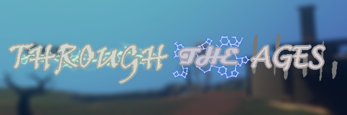

# Through the Ages

### Explore the ***Grand Exhibit***, a museum-station constructed by the Nomai. An exploration through the ages of the Nomai's past and future.

---

Through the Ages is a story mod built in 18 days by "Team Fred" during the [2026 Outer Wilds Summer Jam](https://outerwildsmods.com/jam/aug-2026/) (aka Jam 6)

## Mod Incompatibility List
TimeSaver - Turn off "Start with Suit" for best play experience

## Credits:
- **Art**: Music, Programming, Some Unity work (including foliage)
- **CrystalENVT**: Programming, Text (& Nomai Writing) Formatting, GitHub Repo Admin / Maintainer
- **Gay Coffee**: Lead Writer
- **Hamstry**: Lead Unity developer, Programming, Constellation Art
- **The Phantom Driver**: Nomai Ruin Architect, Modeller, Some Programming
- **T3rtu**: Lead Modeller

## Additional Credits:
- **Solec**: Logo Designer

Made with Love, by Humans <3

---

Through The Ages Unity Assets Repo: https://github.com/Jam-6-Team-Fred/Jam6-Unity
